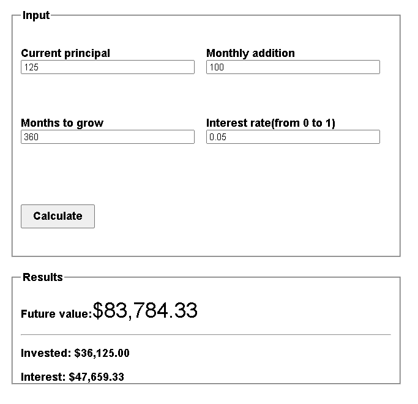

Financial Education Website

[https://lswebdevelops.github.io/FinancialDecisionsWebpack/compoundCalculator.html](https://lswebdevelops.github.io/FinancialDecisionsWebpack/dist/compoundCalculator.html)

This is a website designed to provide educational resources on financial management and help users make informed decisions about their finances. The website includes several chapters that cover different financial topics, such as setting financial goals, budgeting, investing, and more.

Technologies Used

HTML
CSS
JavaScript
Jest
Webpack

Features

Compound interest calculator
We recently added a compound interest calculator to the website, which allows users to calculate their potential earnings on an investment with compound interest. Here's a screenshot of what the calculator looks like:

How to Use
To use the financial education website, simply navigate to the homepage and select a chapter to begin learning about different financial topics. You can also use the interactive features on the website, such as the budget calculator and investment calculator, to help you make informed financial decisions.

Contributors
Luciano Sardanha(lswebdevelops)
License
This project is licensed under the MIT License - see the LICENSE file for details.

Feel free to customize this README.md file according to your project's specific needs. Good luck with your financial education website!
